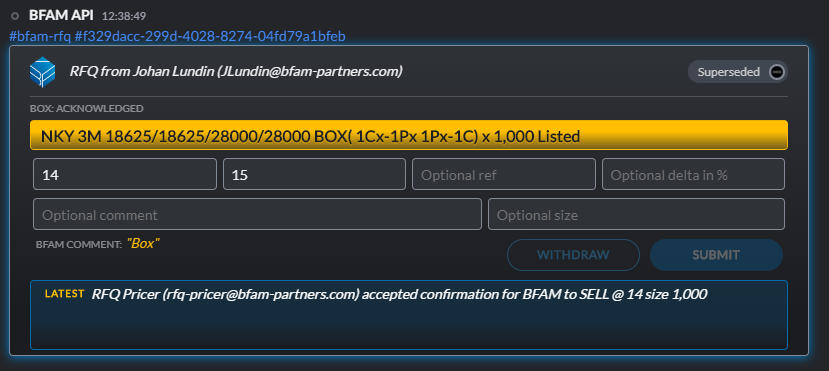
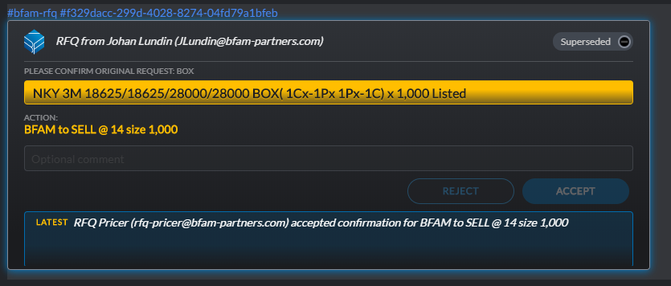
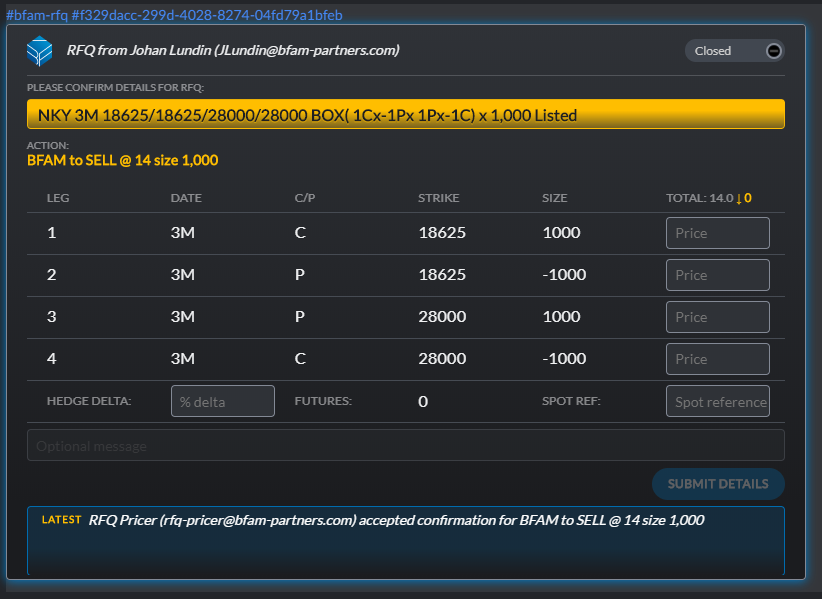

BFAM RFQ App<br><br>Eq Deriv API Developers Guide
========================================

November 15th, 2019

Introduction
============

This document describes the API available to interact with the BFAM Symphony RFQ
Application. As of now only equity derivatives are supported but going forward
additional asset classes will be supported.

Workflow
========

The basic work flow is essentially:

1.  RFQ is sent from BFAM

2.  Broker acknowledges the RFQ

3.  Broker sends price

4.  BFAM optionally sends updated tickets with new comments any number of times

5.  BFAM accepts, passes or trades away (trading with another broker)

6.  Broker accepts

7.  Optionally for multi legged trades broker sends individual leg prices

This boils down to three distinct tickets:

**RFQ ticket**  
Can be sent initially and followed up with any number of refinement



**Confirmation ticket**  
Is sent when BFAM accepts. Identified in code by the confMsg being set



**Leg structure**  
Only applies to multi legged structures and identified by a structure object
being sent



For a complete state diagram please see workflow diagram below.

Reference implementation
========================

The BFAM sends RFQs as custom Symphony messages. These can be intercepted by a
Symphony bot and decoded as described below. The responses back to BFAM are HTTP
requests that goes to the BFAM Symphony app server. A NodeJS reference
implementation is provided at <https://github.com/bfampartners/dev-guide>

### To test it out:

1.  Generate PKI key pair and setup your bot account in your Symphony
    environment.

    1.  mkdir rsa

    2.  cd rsa

    3.  openssl genrsa -out ./privatekey.pem 4096

    4.  openssl req -newkey rsa:4096 -x509 -key ./privatekey.pem -out
        ./publickey.cer

    5.  openssl pkcs8 -topk8 -nocrypt -in ./privatekey.pem -out
        ./privatekey.pkcs8

    6.  openssl x509 -pubkey -noout -in ./publickey.cer \> ./publickey.pem

2.  Update the config.json files with your bot info

3.  Include the bot in an RFQ chat room. Note that this sample implementation
    does quote and accept real RFQs so should only be used in unmodified form in
    a test environment.

4.  Build the bot

    1.  npm install

    2.  npm audit fix

5.  Run the bot:

    1.  npm start

Message structure
=================

### Top level messages:

These messages arrive as entity data messages in the Symphony chat room.

rfqMessage - the text string, if blank it has been sent before and can be linked
back using rfqId

rfqId - unique id per broker and RFQ ticket

blastId - unique id to link multiple brokers to same RFQ, primarily for use by
BFAM

rfqSender - BFAM trader

comment - Optional comment, goes both ways

spotRef - Current spot price reference used for hedging

delta - Amount to hedge in percent, typically with futures

altSize - Alternative size if the broker can't do the full amount

confMsg - Message for trade confirmation (only set when confirmation requested)

listed - If option is listed or OTC

structure, contains a list of legs for the value (only set when leg prices are
requested)

Leg info:

>   \- expiry date - The date the option expires

>   \- type - Call or Put option

>   \- strike - Strike price

>   \- ratio - The relative amount within the structure

### BFML (BFAM Financial Markup Language)

BFML is meant for bot consumption and should be straight forward to feed into a
pricing engine. BFML structure example:

{

"type": "equity", // Type of instrument -\> decides the field within the legs

"structure": [

{

"LegId": 1, // Leg number

"Underlying": "HSCEI Index", // Underlying asset

"Type": "OptionDefPremium", // Type of option. Valid values are:

Option                               // Equity option

>   Forward,                           // Equity forward

>   OptionDefPremium,       // Equity option with deferred premium (paid at
>   maturity)

>   Varswap,                          // Variance swap
>   <https://www.investopedia.com/terms/v/varianceswap.asp>

>   Volswap,                          // Volatility Swap
>   <https://www.investopedia.com/terms/v/volatilityswap.asp>

>   Divswap,                          // Dividend swap
>   <https://www.investment-and-finance.net/derivatives/d/dividend-swap.html>

>   Gammaswap                   // Gamma swap
>   <https://www.investment-and-finance.net/derivatives/g/gamma-swap.html>

"Expiry": "jun20", // Expiry as in RFQ request

"ExpiryDate": "2019-06-30", // The exact expiry date

"Strike": 10600, // Strike price

"PercStrike": false, // If the strike is absolute or a percentage

"IsOTC": false, // If product is OTC or listed

"CP": "P", // Put or Call

"AE": "E", // American or European style option

"Ratio": 2, // Relative ratio as above

"OTCQty": 10000, // Quantity as specified OTC (in terms of options, for var,vol
and gamma swaps it is in notional USD)

"ListedQty": 200, // Quantity in listed terms

"OptMult": 50, // Option multiplier

"RefValue": 10890, // Spot reference price

"RefDate": "2019-11-28" // Spot reference date

<br>Example full workflow messages (Straddle)
=============================================

### BFAM sends RFQ ticket

**rfqMessage:** "NKY 3M 23375 STRD(+1Px+1C) x 1,000 Listed"

**bfml:** {"type":"equity","structure":[{"LegId":1,"Underlying":"NKY
Index","Type":"Option","Expiry":"3M","ExpiryDate":"2020-02-17","Strike":23375,"PercStrike":false,"IsOTC":false,"CP":"P","AE":"E","Ratio":1,"OTCQty":1000000,"ListedQty":1000,"OptMult":1000,"RefValue":null,"RefDate":null},{"LegId":2,"Underlying":"NKY
Index","Type":"Option","Expiry":"3M","ExpiryDate":"2020-02-17","Strike":23375,"PercStrike":false,"IsOTC":false,"CP":"C","AE":"E","Ratio":1,"OTCQty":1000000,"ListedQty":1000,"OptMult":1000,"RefValue":null,"RefDate":null}]}  
**comment:** Good morning, looking for a price on a straddle

### Broker acknowledges and sends quote

### BFAM requests better price (optional step/steps)

**rfqMessage:** "NKY 3M 23375 STRD(+1Px+1C) x 1,000 Listed"

**bfml:** as above  
**comment:** “Could you do better?"

### Broker acknowledges and sends updated quote/quotes<br>

**BFAM sends Confirmation Ticket**  
**rfqMessage:** "NKY 3M 23375 STRD(+1Px+1C) x 1,000 Listed"  
**bfml:** as above  
**confMsg:** "BFAM to SELL \@ 14 size 1,000"

**Broker confirms**

**BFAM sends request for Leg Structure**  
**rfqMessage:** “BFAM to SELL \@ 14 size 1,000"  
**bfml:** as above  
**structure:**
{"hedge":true,"legs":[{"date":"3M","strike":23375,"type":"P","ratio":1},{"date":"3M","strike":23375,"type":"C","ratio":1}]}

**Broker sends leg prices**

Product Reference
=================

A list of the current product universe and its RFQ messages and BFML structures.

Box
---

### rfqMessage

"NKY 3M 18500/18500/27750/27750 BOX(+1Cx-1Px+1Px-1C) x 1,000 Listed"

**bfml**  
{"type":"equity","structure":[{"LegId":1,"Underlying":"NKY
Index","Type":"Option","Expiry":"3M","ExpiryDate":"2020-02-14","Strike":18500,"PercStrike":false,"IsOTC":false,"CP":"C","AE":"E","Ratio":1,"OTCQty":1000000,"ListedQty":1000,"OptMult":1000,"RefValue":null,"RefDate":null},{"LegId":2,"Underlying":"NKY
Index","Type":"Option","Expiry":"3M","ExpiryDate":"2020-02-14","Strike":18500,"PercStrike":false,"IsOTC":false,"CP":"P","AE":"E","Ratio":-1,"OTCQty":-1000000,"ListedQty":-1000,"OptMult":1000,"RefValue":null,"RefDate":null},{"LegId":3,"Underlying":"NKY
Index","Type":"Option","Expiry":"3M","ExpiryDate":"2020-02-14","Strike":27750,"PercStrike":false,"IsOTC":false,"CP":"P","AE":"E","Ratio":1,"OTCQty":1000000,"ListedQty":1000,"OptMult":1000,"RefValue":null,"RefDate":null},{"LegId":4,"Underlying":"NKY
Index","Type":"Option","Expiry":"3M","ExpiryDate":"2020-02-14","Strike":27750,"PercStrike":false,"IsOTC":false,"CP":"C","AE":"E","Ratio":-1,"OTCQty":-1000000,"ListedQty":-1000,"OptMult":1000,"RefValue":null,"RefDate":null}]}

Call
----

### rfqMessage

"NKY 3M 23125 CALL(+1C) x 1,000 Listed"

**bfml**  
{"type":"equity","structure":[{"LegId":1,"Underlying":"NKY
Index","Type":"Option","Expiry":"3M","ExpiryDate":"2020-02-14","Strike":23125,"PercStrike":false,"IsOTC":false,"CP":"C","AE":"E","Ratio":1,"OTCQty":1000000,"ListedQty":1000,"OptMult":1000,"RefValue":null,"RefDate":null}]}

Call Calendar
-------------

### rfqMessage

"NKY 1M/3M 23125 CALL_CALD(-1Cx+1C) x 1,000 Listed"

**bfml**  
{"type":"equity","structure":[{"LegId":1,"Underlying":"NKY
Index","Type":"Option","Expiry":"1M","ExpiryDate":"2019-12-16","Strike":23125,"PercStrike":false,"IsOTC":false,"CP":"C","AE":"E","Ratio":-1,"OTCQty":-1000000,"ListedQty":-1000,"OptMult":1000,"RefValue":null,"RefDate":null},{"LegId":2,"Underlying":"NKY
Index","Type":"Option","Expiry":"3M","ExpiryDate":"2020-02-14","Strike":23125,"PercStrike":false,"IsOTC":false,"CP":"C","AE":"E","Ratio":1,"OTCQty":1000000,"ListedQty":1000,"OptMult":1000,"RefValue":null,"RefDate":null}]}

Call Diagonal
-------------

### rfqMessage

"NKY 1M/3M 23250/25625 CALL_DIAG(-1Cx+1C) x 1,000 Listed"

**bfml**  
{"type":"equity","structure":[{"LegId":1,"Underlying":"NKY
Index","Type":"Option","Expiry":"1M","ExpiryDate":"2019-12-16","Strike":23250,"PercStrike":false,"IsOTC":false,"CP":"C","AE":"E","Ratio":-1,"OTCQty":-1000000,"ListedQty":-1000,"OptMult":1000,"RefValue":null,"RefDate":null},{"LegId":2,"Underlying":"NKY
Index","Type":"Option","Expiry":"3M","ExpiryDate":"2020-02-17","Strike":25625,"PercStrike":false,"IsOTC":false,"CP":"C","AE":"E","Ratio":1,"OTCQty":1000000,"ListedQty":1000,"OptMult":1000,"RefValue":null,"RefDate":null}]}

Call Fly
--------

### rfqMessage

"NKY 3M 23250/24500/25625 CALL_FLY(+1Cx-2Cx+1C) x 1,000 Listed"

**bfml**  
{"type":"equity","structure":[{"LegId":1,"Underlying":"NKY
Index","Type":"Option","Expiry":"3M","ExpiryDate":"2020-02-17","Strike":23250,"PercStrike":false,"IsOTC":false,"CP":"C","AE":"E","Ratio":1,"OTCQty":1000000,"ListedQty":1000,"OptMult":1000,"RefValue":null,"RefDate":null},{"LegId":2,"Underlying":"NKY
Index","Type":"Option","Expiry":"3M","ExpiryDate":"2020-02-17","Strike":24500,"PercStrike":false,"IsOTC":false,"CP":"C","AE":"E","Ratio":-2,"OTCQty":-2000000,"ListedQty":-2000,"OptMult":1000,"RefValue":null,"RefDate":null},{"LegId":3,"Underlying":"NKY
Index","Type":"Option","Expiry":"3M","ExpiryDate":"2020-02-17","Strike":25625,"PercStrike":false,"IsOTC":false,"CP":"C","AE":"E","Ratio":1,"OTCQty":1000000,"ListedQty":1000,"OptMult":1000,"RefValue":null,"RefDate":null}]}

Call Condor
-----------

### rfqMessage

"NKY 3M 23250/24500/25625/26750 CALL_CONDOR(+1Cx-1Cx-1Cx+1C) x 1,000 Listed"

**bfml**  
{"type":"equity","structure":[{"LegId":1,"Underlying":"NKY
Index","Type":"Option","Expiry":"3M","ExpiryDate":"2020-02-17","Strike":23250,"PercStrike":false,"IsOTC":false,"CP":"C","AE":"E","Ratio":1,"OTCQty":1000000,"ListedQty":1000,"OptMult":1000,"RefValue":null,"RefDate":null},{"LegId":2,"Underlying":"NKY
Index","Type":"Option","Expiry":"3M","ExpiryDate":"2020-02-17","Strike":24500,"PercStrike":false,"IsOTC":false,"CP":"C","AE":"E","Ratio":-1,"OTCQty":-1000000,"ListedQty":-1000,"OptMult":1000,"RefValue":null,"RefDate":null},{"LegId":3,"Underlying":"NKY
Index","Type":"Option","Expiry":"3M","ExpiryDate":"2020-02-17","Strike":25625,"PercStrike":false,"IsOTC":false,"CP":"C","AE":"E","Ratio":-1,"OTCQty":-1000000,"ListedQty":-1000,"OptMult":1000,"RefValue":null,"RefDate":null},{"LegId":4,"Underlying":"NKY
Index","Type":"Option","Expiry":"3M","ExpiryDate":"2020-02-17","Strike":26750,"PercStrike":false,"IsOTC":false,"CP":"C","AE":"E","Ratio":1,"OTCQty":1000000,"ListedQty":1000,"OptMult":1000,"RefValue":null,"RefDate":null}]}

Call Ladder
-----------

### rfqMessage

"NKY 3M 23250/24500/25625 CALL_LADD(+1Cx-1Cx-1C) x 1,000 Listed"

**bfml**  
{"type":"equity","structure":[{"LegId":1,"Underlying":"NKY
Index","Type":"Option","Expiry":"3M","ExpiryDate":"2020-02-17","Strike":23250,"PercStrike":false,"IsOTC":false,"CP":"C","AE":"E","Ratio":1,"OTCQty":1000000,"ListedQty":1000,"OptMult":1000,"RefValue":null,"RefDate":null},{"LegId":2,"Underlying":"NKY
Index","Type":"Option","Expiry":"3M","ExpiryDate":"2020-02-17","Strike":24500,"PercStrike":false,"IsOTC":false,"CP":"C","AE":"E","Ratio":-1,"OTCQty":-1000000,"ListedQty":-1000,"OptMult":1000,"RefValue":null,"RefDate":null},{"LegId":3,"Underlying":"NKY
Index","Type":"Option","Expiry":"3M","ExpiryDate":"2020-02-17","Strike":25625,"PercStrike":false,"IsOTC":false,"CP":"C","AE":"E","Ratio":-1,"OTCQty":-1000000,"ListedQty":-1000,"OptMult":1000,"RefValue":null,"RefDate":null}]}

Call Ratio
----------

### rfqMessage

"NKY 3M 23250/25625 CALL_RATIO(+1Cx-2C) x 1,000 Listed"

**bfml**  
{"type":"equity","structure":[{"LegId":1,"Underlying":"NKY
Index","Type":"Option","Expiry":"3M","ExpiryDate":"2020-02-17","Strike":23250,"PercStrike":false,"IsOTC":false,"CP":"C","AE":"E","Ratio":1,"OTCQty":1000000,"ListedQty":1000,"OptMult":1000,"RefValue":null,"RefDate":null},{"LegId":2,"Underlying":"NKY
Index","Type":"Option","Expiry":"3M","ExpiryDate":"2020-02-17","Strike":25625,"PercStrike":false,"IsOTC":false,"CP":"C","AE":"E","Ratio":-2,"OTCQty":-2000000,"ListedQty":-2000,"OptMult":1000,"RefValue":null,"RefDate":null}]}

Call Spread
-----------

### rfqMessage

"NKY 3M 23250/25625 CALL_SPD(+1Cx-1C) x 1,000 Listed"

**bfml**  
{"type":"equity","structure":[{"LegId":1,"Underlying":"NKY
Index","Type":"Option","Expiry":"3M","ExpiryDate":"2020-02-17","Strike":23250,"PercStrike":false,"IsOTC":false,"CP":"C","AE":"E","Ratio":1,"OTCQty":1000000,"ListedQty":1000,"OptMult":1000,"RefValue":null,"RefDate":null},{"LegId":2,"Underlying":"NKY
Index","Type":"Option","Expiry":"3M","ExpiryDate":"2020-02-17","Strike":25625,"PercStrike":false,"IsOTC":false,"CP":"C","AE":"E","Ratio":-1,"OTCQty":-1000000,"ListedQty":-1000,"OptMult":1000,"RefValue":null,"RefDate":null}]}

Dividend Swap
-------------

### rfqMessage

"NKY DEC15 1 DIV_SWAP(+1D) x 1,000 Listed"

**bfml**  
{"type":"equity","structure":[{"LegId":1,"Underlying":"NKY
Index","Type":"Divswap","Expiry":"dec15","ExpiryDate":"2015-12-11","Strike":1,"PercStrike":false,"IsOTC":false,"CP":"D","AE":"E","Ratio":1,"OTCQty":1000000,"ListedQty":1000,"OptMult":1000,"RefValue":null,"RefDate":null}]}

Forward
-------

### rfqMessage

"NKY 3M FORWARD(+1) x 1,000 Listed"

**bfml**  
{"type":"equity","structure":[{"LegId":1,"Underlying":"NKY
Index","Type":"Forward","Expiry":"3M","ExpiryDate":"2020-02-17","Strike":1,"PercStrike":true,"IsOTC":false,"CP":"F","AE":"E","Ratio":1,"OTCQty":1000000,"ListedQty":1000,"OptMult":1000,"RefValue":null,"RefDate":null}]}

Iron
----

### rfqMessage

"NKY 3M 21000/23250/23250/25625 IRON(+1Px-1Px-1Cx+1C) x 1,000 Listed"

**bfml**  
{"type":"equity","structure":[{"LegId":1,"Underlying":"NKY
Index","Type":"Option","Expiry":"3M","ExpiryDate":"2020-02-17","Strike":21000,"PercStrike":false,"IsOTC":false,"CP":"P","AE":"E","Ratio":1,"OTCQty":1000000,"ListedQty":1000,"OptMult":1000,"RefValue":null,"RefDate":null},{"LegId":2,"Underlying":"NKY
Index","Type":"Option","Expiry":"3M","ExpiryDate":"2020-02-17","Strike":23250,"PercStrike":false,"IsOTC":false,"CP":"P","AE":"E","Ratio":-1,"OTCQty":-1000000,"ListedQty":-1000,"OptMult":1000,"RefValue":null,"RefDate":null},{"LegId":3,"Underlying":"NKY
Index","Type":"Option","Expiry":"3M","ExpiryDate":"2020-02-17","Strike":23250,"PercStrike":false,"IsOTC":false,"CP":"C","AE":"E","Ratio":-1,"OTCQty":-1000000,"ListedQty":-1000,"OptMult":1000,"RefValue":null,"RefDate":null},{"LegId":4,"Underlying":"NKY
Index","Type":"Option","Expiry":"3M","ExpiryDate":"2020-02-17","Strike":25625,"PercStrike":false,"IsOTC":false,"CP":"C","AE":"E","Ratio":1,"OTCQty":1000000,"ListedQty":1000,"OptMult":1000,"RefValue":null,"RefDate":null}]}

Put
---

### rfqMessage

"NKY 3M 23250 PUT(+1P) x 1,000 Listed"

**bfml**  
{"type":"equity","structure":[{"LegId":1,"Underlying":"NKY
Index","Type":"Option","Expiry":"3M","ExpiryDate":"2020-02-17","Strike":23250,"PercStrike":false,"IsOTC":false,"CP":"P","AE":"E","Ratio":1,"OTCQty":1000000,"ListedQty":1000,"OptMult":1000,"RefValue":null,"RefDate":null}]}

Put Calendar
------------

### rfqMessage

"NKY 1M/3M 23250 PUT_CALD(-1Px+1P) x 1,000 Listed"

**bfml**  
{"type":"equity","structure":[{"LegId":1,"Underlying":"NKY
Index","Type":"Option","Expiry":"1M","ExpiryDate":"2019-12-16","Strike":23250,"PercStrike":false,"IsOTC":false,"CP":"P","AE":"E","Ratio":-1,"OTCQty":-1000000,"ListedQty":-1000,"OptMult":1000,"RefValue":null,"RefDate":null},{"LegId":2,"Underlying":"NKY
Index","Type":"Option","Expiry":"3M","ExpiryDate":"2020-02-17","Strike":23250,"PercStrike":false,"IsOTC":false,"CP":"P","AE":"E","Ratio":1,"OTCQty":1000000,"ListedQty":1000,"OptMult":1000,"RefValue":null,"RefDate":null}]}

Put Diagonal
------------

### rfqMessage

"NKY 1M/3M 23250/21000 PUT_DIAG(-1Px+1P) x 1,000 Listed"

**bfml**  
{"type":"equity","structure":[{"LegId":1,"Underlying":"NKY
Index","Type":"Option","Expiry":"1M","ExpiryDate":"2019-12-16","Strike":23250,"PercStrike":false,"IsOTC":false,"CP":"P","AE":"E","Ratio":-1,"OTCQty":-1000000,"ListedQty":-1000,"OptMult":1000,"RefValue":null,"RefDate":null},{"LegId":2,"Underlying":"NKY
Index","Type":"Option","Expiry":"3M","ExpiryDate":"2020-02-17","Strike":21000,"PercStrike":false,"IsOTC":false,"CP":"P","AE":"E","Ratio":1,"OTCQty":1000000,"ListedQty":1000,"OptMult":1000,"RefValue":null,"RefDate":null}]}

Put Fly
-------

### rfqMessage

"NKY 3M 23250/22125/21000 PUT_FLY(+1Px-2Px+1P) x 1,000 Listed"

**bfml**  
{"type":"equity","structure":[{"LegId":1,"Underlying":"NKY
Index","Type":"Option","Expiry":"3M","ExpiryDate":"2020-02-17","Strike":23250,"PercStrike":false,"IsOTC":false,"CP":"P","AE":"E","Ratio":1,"OTCQty":1000000,"ListedQty":1000,"OptMult":1000,"RefValue":null,"RefDate":null},{"LegId":2,"Underlying":"NKY
Index","Type":"Option","Expiry":"3M","ExpiryDate":"2020-02-17","Strike":22125,"PercStrike":false,"IsOTC":false,"CP":"P","AE":"E","Ratio":-2,"OTCQty":-2000000,"ListedQty":-2000,"OptMult":1000,"RefValue":null,"RefDate":null},{"LegId":3,"Underlying":"NKY
Index","Type":"Option","Expiry":"3M","ExpiryDate":"2020-02-17","Strike":21000,"PercStrike":false,"IsOTC":false,"CP":"P","AE":"E","Ratio":1,"OTCQty":1000000,"ListedQty":1000,"OptMult":1000,"RefValue":null,"RefDate":null}]}

Put Condor
----------

### rfqMessage

"NKY 3M 23250/22125/21000/19750 PUT_CONDOR(+1Px-1Px-1Px+1P) x 1,000 Listed"

**bfml**  
{"type":"equity","structure":[{"LegId":1,"Underlying":"NKY
Index","Type":"Option","Expiry":"3M","ExpiryDate":"2020-02-17","Strike":23250,"PercStrike":false,"IsOTC":false,"CP":"P","AE":"E","Ratio":1,"OTCQty":1000000,"ListedQty":1000,"OptMult":1000,"RefValue":null,"RefDate":null},{"LegId":2,"Underlying":"NKY
Index","Type":"Option","Expiry":"3M","ExpiryDate":"2020-02-17","Strike":22125,"PercStrike":false,"IsOTC":false,"CP":"P","AE":"E","Ratio":-1,"OTCQty":-1000000,"ListedQty":-1000,"OptMult":1000,"RefValue":null,"RefDate":null},{"LegId":3,"Underlying":"NKY
Index","Type":"Option","Expiry":"3M","ExpiryDate":"2020-02-17","Strike":21000,"PercStrike":false,"IsOTC":false,"CP":"P","AE":"E","Ratio":-1,"OTCQty":-1000000,"ListedQty":-1000,"OptMult":1000,"RefValue":null,"RefDate":null},{"LegId":4,"Underlying":"NKY
Index","Type":"Option","Expiry":"3M","ExpiryDate":"2020-02-17","Strike":19750,"PercStrike":false,"IsOTC":false,"CP":"P","AE":"E","Ratio":1,"OTCQty":1000000,"ListedQty":1000,"OptMult":1000,"RefValue":null,"RefDate":null}]}

Put Ladder
----------

### rfqMessage

"NKY 3M 23250/22125/21000 PUT_LADD(+1Px-1Px-1P) x 1,000 Listed"

**bfml**  
{"type":"equity","structure":[{"LegId":1,"Underlying":"NKY
Index","Type":"Option","Expiry":"3M","ExpiryDate":"2020-02-17","Strike":23250,"PercStrike":false,"IsOTC":false,"CP":"P","AE":"E","Ratio":1,"OTCQty":1000000,"ListedQty":1000,"OptMult":1000,"RefValue":null,"RefDate":null},{"LegId":2,"Underlying":"NKY
Index","Type":"Option","Expiry":"3M","ExpiryDate":"2020-02-17","Strike":22125,"PercStrike":false,"IsOTC":false,"CP":"P","AE":"E","Ratio":-1,"OTCQty":-1000000,"ListedQty":-1000,"OptMult":1000,"RefValue":null,"RefDate":null},{"LegId":3,"Underlying":"NKY
Index","Type":"Option","Expiry":"3M","ExpiryDate":"2020-02-17","Strike":21000,"PercStrike":false,"IsOTC":false,"CP":"P","AE":"E","Ratio":-1,"OTCQty":-1000000,"ListedQty":-1000,"OptMult":1000,"RefValue":null,"RefDate":null}]}

Put Ratio
---------

### rfqMessage

"NKY 3M 23250/20875 PUT_RATIO(+1Px-2P) x 1,000 Listed"

**bfml**  
{"type":"equity","structure":[{"LegId":1,"Underlying":"NKY
Index","Type":"Option","Expiry":"3M","ExpiryDate":"2020-02-17","Strike":23250,"PercStrike":false,"IsOTC":false,"CP":"P","AE":"E","Ratio":1,"OTCQty":1000000,"ListedQty":1000,"OptMult":1000,"RefValue":null,"RefDate":null},{"LegId":2,"Underlying":"NKY
Index","Type":"Option","Expiry":"3M","ExpiryDate":"2020-02-17","Strike":20875,"PercStrike":false,"IsOTC":false,"CP":"P","AE":"E","Ratio":-2,"OTCQty":-2000000,"ListedQty":-2000,"OptMult":1000,"RefValue":null,"RefDate":null}]}

Put Spread
----------

### rfqMessage

"NKY 3M 23250/21000 PUT_SPD(+1Px-1P) x 1,000 Listed"

**bfml**  
{"type":"equity","structure":[{"LegId":1,"Underlying":"NKY
Index","Type":"Option","Expiry":"3M","ExpiryDate":"2020-02-17","Strike":23250,"PercStrike":false,"IsOTC":false,"CP":"P","AE":"E","Ratio":1,"OTCQty":1000000,"ListedQty":1000,"OptMult":1000,"RefValue":null,"RefDate":null},{"LegId":2,"Underlying":"NKY
Index","Type":"Option","Expiry":"3M","ExpiryDate":"2020-02-17","Strike":21000,"PercStrike":false,"IsOTC":false,"CP":"P","AE":"E","Ratio":-1,"OTCQty":-1000000,"ListedQty":-1000,"OptMult":1000,"RefValue":null,"RefDate":null}]}

Put Spread vs Call
------------------

### rfqMessage

"NKY 3M 20875/22125/24375 PUT_SPDvC(+1Px-1Px-1C) x 1,000 Listed"

**bfml**  
{"type":"equity","structure":[{"LegId":1,"Underlying":"NKY
Index","Type":"Option","Expiry":"3M","ExpiryDate":"2020-02-17","Strike":20875,"PercStrike":false,"IsOTC":false,"CP":"P","AE":"E","Ratio":1,"OTCQty":1000000,"ListedQty":1000,"OptMult":1000,"RefValue":null,"RefDate":null},{"LegId":2,"Underlying":"NKY
Index","Type":"Option","Expiry":"3M","ExpiryDate":"2020-02-17","Strike":22125,"PercStrike":false,"IsOTC":false,"CP":"P","AE":"E","Ratio":-1,"OTCQty":-1000000,"ListedQty":-1000,"OptMult":1000,"RefValue":null,"RefDate":null},{"LegId":3,"Underlying":"NKY
Index","Type":"Option","Expiry":"3M","ExpiryDate":"2020-02-17","Strike":24375,"PercStrike":false,"IsOTC":false,"CP":"C","AE":"E","Ratio":-1,"OTCQty":-1000000,"ListedQty":-1000,"OptMult":1000,"RefValue":null,"RefDate":null}]}

Call Spread vs Put
------------------

### rfqMessage

"NKY 3M 25625/24375/22125 CALL_SPDvP(+1Cx-1Cx-1P) x 1,000 Listed"

**bfml**  
{"type":"equity","structure":[{"LegId":1,"Underlying":"NKY
Index","Type":"Option","Expiry":"3M","ExpiryDate":"2020-02-17","Strike":25625,"PercStrike":false,"IsOTC":false,"CP":"C","AE":"E","Ratio":1,"OTCQty":1000000,"ListedQty":1000,"OptMult":1000,"RefValue":null,"RefDate":null},{"LegId":2,"Underlying":"NKY
Index","Type":"Option","Expiry":"3M","ExpiryDate":"2020-02-17","Strike":24375,"PercStrike":false,"IsOTC":false,"CP":"C","AE":"E","Ratio":-1,"OTCQty":-1000000,"ListedQty":-1000,"OptMult":1000,"RefValue":null,"RefDate":null},{"LegId":3,"Underlying":"NKY
Index","Type":"Option","Expiry":"3M","ExpiryDate":"2020-02-17","Strike":22125,"PercStrike":false,"IsOTC":false,"CP":"P","AE":"E","Ratio":-1,"OTCQty":-1000000,"ListedQty":-1000,"OptMult":1000,"RefValue":null,"RefDate":null}]}

Put Spread vs Call Spread
-------------------------

### rfqMessage

"NKY 3M 20875/22125/24375/25625 PUT_SPDvCALL_SPD(-1Px+1Px-1Cx+1C) x 1,000
Listed"

**bfml**  
{"type":"equity","structure":[{"LegId":1,"Underlying":"NKY
Index","Type":"Option","Expiry":"3M","ExpiryDate":"2020-02-17","Strike":20875,"PercStrike":false,"IsOTC":false,"CP":"P","AE":"E","Ratio":-1,"OTCQty":-1000000,"ListedQty":-1000,"OptMult":1000,"RefValue":null,"RefDate":null},{"LegId":2,"Underlying":"NKY
Index","Type":"Option","Expiry":"3M","ExpiryDate":"2020-02-17","Strike":22125,"PercStrike":false,"IsOTC":false,"CP":"P","AE":"E","Ratio":1,"OTCQty":1000000,"ListedQty":1000,"OptMult":1000,"RefValue":null,"RefDate":null},{"LegId":3,"Underlying":"NKY
Index","Type":"Option","Expiry":"3M","ExpiryDate":"2020-02-17","Strike":24375,"PercStrike":false,"IsOTC":false,"CP":"C","AE":"E","Ratio":-1,"OTCQty":-1000000,"ListedQty":-1000,"OptMult":1000,"RefValue":null,"RefDate":null},{"LegId":4,"Underlying":"NKY
Index","Type":"Option","Expiry":"3M","ExpiryDate":"2020-02-17","Strike":25625,"PercStrike":false,"IsOTC":false,"CP":"C","AE":"E","Ratio":1,"OTCQty":1000000,"ListedQty":1000,"OptMult":1000,"RefValue":null,"RefDate":null}]}

Call Spread vs Put Spread
-------------------------

### rfqMessage

"NKY 3M 25625/24375/22125/20875 CALL_SPDvPUT_SPD(+1Cx-1Cx+1Px-1P) x 1,000
Listed"

**bfml**  
{"type":"equity","structure":[{"LegId":1,"Underlying":"NKY
Index","Type":"Option","Expiry":"3M","ExpiryDate":"2020-02-17","Strike":25625,"PercStrike":false,"IsOTC":false,"CP":"C","AE":"E","Ratio":1,"OTCQty":1000000,"ListedQty":1000,"OptMult":1000,"RefValue":null,"RefDate":null},{"LegId":2,"Underlying":"NKY
Index","Type":"Option","Expiry":"3M","ExpiryDate":"2020-02-17","Strike":24375,"PercStrike":false,"IsOTC":false,"CP":"C","AE":"E","Ratio":-1,"OTCQty":-1000000,"ListedQty":-1000,"OptMult":1000,"RefValue":null,"RefDate":null},{"LegId":3,"Underlying":"NKY
Index","Type":"Option","Expiry":"3M","ExpiryDate":"2020-02-17","Strike":22125,"PercStrike":false,"IsOTC":false,"CP":"P","AE":"E","Ratio":1,"OTCQty":1000000,"ListedQty":1000,"OptMult":1000,"RefValue":null,"RefDate":null},{"LegId":4,"Underlying":"NKY
Index","Type":"Option","Expiry":"3M","ExpiryDate":"2020-02-17","Strike":20875,"PercStrike":false,"IsOTC":false,"CP":"P","AE":"E","Ratio":-1,"OTCQty":-1000000,"ListedQty":-1000,"OptMult":1000,"RefValue":null,"RefDate":null}]}

Risk Reversal Swap
------------------

### rfqMessage

"NKY 3M/3M/6M/6M 22125/24375/22125/24375 RR_SWAP(-1Px+1Cx+1Px-1C) x 1,000
Listed"

**bfml**  
{"type":"equity","structure":[{"LegId":1,"Underlying":"NKY
Index","Type":"Option","Expiry":"3M","ExpiryDate":"2020-02-17","Strike":22125,"PercStrike":false,"IsOTC":false,"CP":"P","AE":"E","Ratio":-1,"OTCQty":-1000000,"ListedQty":-1000,"OptMult":1000,"RefValue":null,"RefDate":null},{"LegId":2,"Underlying":"NKY
Index","Type":"Option","Expiry":"3M","ExpiryDate":"2020-02-17","Strike":24375,"PercStrike":false,"IsOTC":false,"CP":"C","AE":"E","Ratio":1,"OTCQty":1000000,"ListedQty":1000,"OptMult":1000,"RefValue":null,"RefDate":null},{"LegId":3,"Underlying":"NKY
Index","Type":"Option","Expiry":"6M","ExpiryDate":"2020-05-15","Strike":22125,"PercStrike":false,"IsOTC":false,"CP":"P","AE":"E","Ratio":1,"OTCQty":1000000,"ListedQty":1000,"OptMult":1000,"RefValue":null,"RefDate":null},{"LegId":4,"Underlying":"NKY
Index","Type":"Option","Expiry":"6M","ExpiryDate":"2020-05-15","Strike":24375,"PercStrike":false,"IsOTC":false,"CP":"C","AE":"E","Ratio":-1,"OTCQty":-1000000,"ListedQty":-1000,"OptMult":1000,"RefValue":null,"RefDate":null}]}

Roll
----

### rfqMessage

"NKY 3M/2M ROLL(+1x-1) x 1,000 Listed"

**bfml**  
{"type":"equity","structure":[{"LegId":1,"Underlying":"NKY
Index","Type":"Forward","Expiry":"3M","ExpiryDate":"2020-02-17","Strike":1,"PercStrike":false,"IsOTC":false,"CP":"F","AE":"E","Ratio":1,"OTCQty":1000000,"ListedQty":1000,"OptMult":1000,"RefValue":null,"RefDate":null},{"LegId":2,"Underlying":"NKY
Index","Type":"Forward","Expiry":"2M","ExpiryDate":"2020-01-15","Strike":1,"PercStrike":false,"IsOTC":false,"CP":"F","AE":"E","Ratio":-1,"OTCQty":-1000000,"ListedQty":-1000,"OptMult":1000,"RefValue":null,"RefDate":null}]}

Roll Jelly
----------

### rfqMessage

"NKY 3M/3M/6M/6M 23250 ROLL_JELLY(+1Cx-1Px-1Cx+1P) x 1,000 Listed"

**bfml**  
{"type":"equity","structure":[{"LegId":1,"Underlying":"NKY
Index","Type":"Option","Expiry":"3M","ExpiryDate":"2020-02-17","Strike":23250,"PercStrike":false,"IsOTC":false,"CP":"C","AE":"E","Ratio":1,"OTCQty":1000000,"ListedQty":1000,"OptMult":1000,"RefValue":null,"RefDate":null},{"LegId":2,"Underlying":"NKY
Index","Type":"Option","Expiry":"3M","ExpiryDate":"2020-02-17","Strike":23250,"PercStrike":false,"IsOTC":false,"CP":"P","AE":"E","Ratio":-1,"OTCQty":-1000000,"ListedQty":-1000,"OptMult":1000,"RefValue":null,"RefDate":null},{"LegId":3,"Underlying":"NKY
Index","Type":"Option","Expiry":"6M","ExpiryDate":"2020-05-15","Strike":23250,"PercStrike":false,"IsOTC":false,"CP":"C","AE":"E","Ratio":-1,"OTCQty":-1000000,"ListedQty":-1000,"OptMult":1000,"RefValue":null,"RefDate":null},{"LegId":4,"Underlying":"NKY
Index","Type":"Option","Expiry":"6M","ExpiryDate":"2020-05-15","Strike":23250,"PercStrike":false,"IsOTC":false,"CP":"P","AE":"E","Ratio":1,"OTCQty":1000000,"ListedQty":1000,"OptMult":1000,"RefValue":null,"RefDate":null}]}

Risk Reversal
-------------

### rfqMessage

"NKY 3M 22125/26750 RR(+1Px-1C) x 1,000 Listed"

**bfml**  
{"type":"equity","structure":[{"LegId":1,"Underlying":"NKY
Index","Type":"Option","Expiry":"3M","ExpiryDate":"2020-02-17","Strike":22125,"PercStrike":false,"IsOTC":false,"CP":"P","AE":"E","Ratio":1,"OTCQty":1000000,"ListedQty":1000,"OptMult":1000,"RefValue":null,"RefDate":null},{"LegId":2,"Underlying":"NKY
Index","Type":"Option","Expiry":"3M","ExpiryDate":"2020-02-17","Strike":26750,"PercStrike":false,"IsOTC":false,"CP":"C","AE":"E","Ratio":-1,"OTCQty":-1000000,"ListedQty":-1000,"OptMult":1000,"RefValue":null,"RefDate":null}]}

Straddle
--------

### rfqMessage

"NKY 3M 23250 STRD(+1Px+1C) x 1,000 Listed"

**bfml**  
{"type":"equity","structure":[{"LegId":1,"Underlying":"NKY
Index","Type":"Option","Expiry":"3M","ExpiryDate":"2020-02-17","Strike":23250,"PercStrike":false,"IsOTC":false,"CP":"P","AE":"E","Ratio":1,"OTCQty":1000000,"ListedQty":1000,"OptMult":1000,"RefValue":null,"RefDate":null},{"LegId":2,"Underlying":"NKY
Index","Type":"Option","Expiry":"3M","ExpiryDate":"2020-02-17","Strike":23250,"PercStrike":false,"IsOTC":false,"CP":"C","AE":"E","Ratio":1,"OTCQty":1000000,"ListedQty":1000,"OptMult":1000,"RefValue":null,"RefDate":null}]}

Straddle Diagonal
-----------------

### rfqMessage

"NKY 3M/3M/1M/1M 23250 STRD_DIAG(+1Cx+1Px-1Cx-1P) x 1,000 Listed"

**bfml**  
{"type":"equity","structure":[{"LegId":1,"Underlying":"NKY
Index","Type":"Option","Expiry":"3M","ExpiryDate":"2020-02-17","Strike":23250,"PercStrike":false,"IsOTC":false,"CP":"C","AE":"E","Ratio":1,"OTCQty":1000000,"ListedQty":1000,"OptMult":1000,"RefValue":null,"RefDate":null},{"LegId":2,"Underlying":"NKY
Index","Type":"Option","Expiry":"3M","ExpiryDate":"2020-02-17","Strike":23250,"PercStrike":false,"IsOTC":false,"CP":"P","AE":"E","Ratio":1,"OTCQty":1000000,"ListedQty":1000,"OptMult":1000,"RefValue":null,"RefDate":null},{"LegId":3,"Underlying":"NKY
Index","Type":"Option","Expiry":"1M","ExpiryDate":"2019-12-16","Strike":23250,"PercStrike":false,"IsOTC":false,"CP":"C","AE":"E","Ratio":-1,"OTCQty":-1000000,"ListedQty":-1000,"OptMult":1000,"RefValue":null,"RefDate":null},{"LegId":4,"Underlying":"NKY
Index","Type":"Option","Expiry":"1M","ExpiryDate":"2019-12-16","Strike":23250,"PercStrike":false,"IsOTC":false,"CP":"P","AE":"E","Ratio":-1,"OTCQty":-1000000,"ListedQty":-1000,"OptMult":1000,"RefValue":null,"RefDate":null}]}

Strangle
--------

### rfqMessage

"NKY 3M 22125/26750 STRG(+1Px+1C) x 1,000 Listed"

**bfml**  
{"type":"equity","structure":[{"LegId":1,"Underlying":"NKY
Index","Type":"Option","Expiry":"3M","ExpiryDate":"2020-02-17","Strike":22125,"PercStrike":false,"IsOTC":false,"CP":"P","AE":"E","Ratio":1,"OTCQty":1000000,"ListedQty":1000,"OptMult":1000,"RefValue":null,"RefDate":null},{"LegId":2,"Underlying":"NKY
Index","Type":"Option","Expiry":"3M","ExpiryDate":"2020-02-17","Strike":26750,"PercStrike":false,"IsOTC":false,"CP":"C","AE":"E","Ratio":1,"OTCQty":1000000,"ListedQty":1000,"OptMult":1000,"RefValue":null,"RefDate":null}]}

Synthetic
---------

### rfqMessage

"NKY 3M 23250 SYNT(-1Cx+1P) x 1,000 Listed"

**bfml**  
{"type":"equity","structure":[{"LegId":1,"Underlying":"NKY
Index","Type":"Option","Expiry":"3M","ExpiryDate":"2020-02-17","Strike":23250,"PercStrike":false,"IsOTC":false,"CP":"C","AE":"E","Ratio":-1,"OTCQty":-1000000,"ListedQty":-1000,"OptMult":1000,"RefValue":null,"RefDate":null},{"LegId":2,"Underlying":"NKY
Index","Type":"Option","Expiry":"3M","ExpiryDate":"2020-02-17","Strike":23250,"PercStrike":false,"IsOTC":false,"CP":"P","AE":"E","Ratio":1,"OTCQty":1000000,"ListedQty":1000,"OptMult":1000,"RefValue":null,"RefDate":null}]}

Variance Swap
-------------

### rfqMessage

"NKY 3M VAR_SWAP x USD 100,000"

**bfml**  
{"type":"equity","structure":[{"LegId":1,"Underlying":"NKY
Index","Type":"Varswap","Expiry":"3M","ExpiryDate":"2020-02-17","Strike":1,"PercStrike":true,"IsOTC":true,"CP":"V","AE":"E","Ratio":1,"OTCQty":100000,"ListedQty":100000,"OptMult":1,"RefValue":null,"RefDate":null}]}

Variance vs Volatility Swap
---------------------------

### rfqMessage

"NKY 3M VAR_VOL x USD 100,000"

**bfml**  
{"type":"equity","structure":[{"LegId":1,"Underlying":"NKY
Index","Type":"Varswap","Expiry":"3M","ExpiryDate":"2020-02-17","Strike":1,"PercStrike":true,"IsOTC":true,"CP":"V","AE":"E","Ratio":1,"OTCQty":100000,"ListedQty":100000,"OptMult":1,"RefValue":null,"RefDate":null},{"LegId":2,"Underlying":"NKY
Index","Type":"Volswap","Expiry":"3M","ExpiryDate":"2020-02-17","Strike":1,"PercStrike":true,"IsOTC":true,"CP":"v","AE":"E","Ratio":-1,"OTCQty":-100000,"ListedQty":-100000,"OptMult":1,"RefValue":null,"RefDate":null}]}

Variance Swap Forward
---------------------

### rfqMessage

"NKY 3M/6M VAR_SWP_FWD x USD 100,000"

**bfml**  
{"type":"equity","structure":[{"LegId":1,"Underlying":"NKY
Index","Type":"Varswap","Expiry":"3M","ExpiryDate":"2020-02-17","Strike":1,"PercStrike":true,"IsOTC":true,"CP":"V","AE":"E","Ratio":-1.0345,"OTCQty":-103450,"ListedQty":-103450,"OptMult":1,"RefValue":null,"RefDate":null},{"LegId":2,"Underlying":"NKY
Index","Type":"Varswap","Expiry":"6M","ExpiryDate":"2020-05-15","Strike":1,"PercStrike":true,"IsOTC":true,"CP":"V","AE":"E","Ratio":2.0345,"OTCQty":203450,"ListedQty":203450,"OptMult":1,"RefValue":null,"RefDate":null}]}

Variance Swap Spread
--------------------

### rfqMessage

"NKY 3M/6M VAR_SWP_SPD x USD 100,000"

**bfml**  
{"type":"equity","structure":[{"LegId":1,"Underlying":"NKY
Index","Type":"Varswap","Expiry":"3M","ExpiryDate":"2020-02-17","Strike":1,"PercStrike":true,"IsOTC":true,"CP":"V","AE":"E","Ratio":1,"OTCQty":100000,"ListedQty":100000,"OptMult":1,"RefValue":null,"RefDate":null},{"LegId":2,"Underlying":"NKY
Index","Type":"Varswap","Expiry":"6M","ExpiryDate":"2020-05-15","Strike":1,"PercStrike":true,"IsOTC":true,"CP":"V","AE":"E","Ratio":-1,"OTCQty":-100000,"ListedQty":-100000,"OptMult":1,"RefValue":null,"RefDate":null}]}

Volatility Swap
---------------

### rfqMessage

"NKY 3M VOL_SWAP x USD 1,000,000"

**bfml**  
{"type":"equity","structure":[{"LegId":1,"Underlying":"NKY
Index","Type":"Volswap","Expiry":"3M","ExpiryDate":"2020-02-17","Strike":1,"PercStrike":true,"IsOTC":true,"CP":"v","AE":"E","Ratio":1,"OTCQty":1000000,"ListedQty":1000000,"OptMult":1,"RefValue":null,"RefDate":null}]}

Gamma Swap
----------

### rfqMessage

"NKY 3M GAMMA_SWAP x 100,000 Listed"

**bfml**  
{"type":"equity","structure":[{"LegId":1,"Underlying":"NKY
Index","Type":"Gammaswap","Expiry":"3M","ExpiryDate":"2020-02-17","Strike":1,"PercStrike":true,"IsOTC":false,"CP":"G","AE":"E","Ratio":1,"OTCQty":100000,"ListedQty":100000,"OptMult":1,"RefValue":null,"RefDate":null}]}

Custom structure
----------------

This can be any of the products above or more exotic versions. This is just a
three legged sample

### rfqMessage

"NKY 3M 23250 (+1Cx+2Px-1C) x 1,000 Listed"

**bfml**  
{"type":"equity","structure":[{"LegId":1,"Underlying":"NKY
Index","Type":"Option","Expiry":"3M","ExpiryDate":"2020-02-17","Strike":23250,"PercStrike":false,"IsOTC":false,"CP":"C","AE":"E","Ratio":1,"OTCQty":1000000,"ListedQty":1000,"OptMult":1000,"RefValue":null,"RefDate":null},{"LegId":2,"Underlying":"NKY
Index","Type":"Option","Expiry":"3M","ExpiryDate":"2020-02-17","Strike":23250,"PercStrike":false,"IsOTC":false,"CP":"P","AE":"E","Ratio":2,"OTCQty":2000000,"ListedQty":2000,"OptMult":1000,"RefValue":null,"RefDate":null},{"LegId":3,"Underlying":"NKY
Index","Type":"Option","Expiry":"3M","ExpiryDate":"2020-02-17","Strike":23250,"PercStrike":false,"IsOTC":false,"CP":"C","AE":"E","Ratio":-1,"OTCQty":-1000000,"ListedQty":-1000,"OptMult":1000,"RefValue":null,"RefDate":null}]}

Products not covered for auto pricing
-------------------------------------

The following product short codes are not covered for auto pricing:

EFP, PSS, CSS, TRS, S, POP_V, POP_VKS


FX API Developers Guide
========================================

May 3rd, 2021

Introduction
============

This document describes the API available to interact with the BFAM Symphony RFQ Application for FX asset class.


Workflow
========
The basic work flow is essentially:
1. RFQ is sent from BFAM
2. Broker acknowledges the RFQ
3. Broker sends price
4. BFAM optionally sends updated tickets with new comments any number of times
5. BFAM accepts quote or passes
6. Broker accepts or rejects
7. Broker submit trade detail (e.g. reference price)
8. Optionally BFAM sends pass message indicating avarage spread in case broker has not accepted

This boils down to two distinct tickets:

**RFQ ticket**  
It can be sent initially and followed up with any number of refinement.

**Confirmation ticket**  
It is sent when BFAM accepts. Identified in code by the confMsg being set.

# BFML Structure
## FX Swap
```json
{
	"type": "FxSwap",
	"structure": {
		"_class": "com.bfam.fxautoquoter.models.FxSwap",
		"title": "USDTWD",
		"ccyPair": "USDTWD",
		"ccy": "USD",
		"quantity": 1000000.0,
		"settlementDate": "2021-06-03",
		"farCcy": "USD",
		"farQuantity": 1000000.0,
		"farSettlementDate": "2021-11-03"
	}
}
```

## CNHCNY
```json
{
	"type": "Basis",
	"structure": {
		"_class": "com.bfam.fxautoquoter.models.Basis",
		"title": "CNHCNY",
		"ccyPair": "CNHCNY",
		"ccy": "USD",
		"quantity": 1000000.0,
		"settlementDate": "2021-05-28"
	}
}
```

## Forward
```json
{
	"type": "Forward",
	"structure": {
		"_class": "com.bfam.fxautoquoter.models.Forward",
		"title": "EURUSD",
		"ccyPair": "EURUSD",
		"ccy": "EUR",
		"quantity": 1000000.0,
		"settlementDate": "2021-05-28"
	}
}
```
