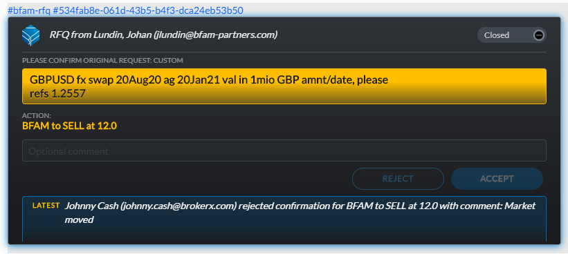

BFAM RFQ App<br><br>FX API Developers Guide
========================================

July 16th, 2020

Introduction
============

This document describes the API available to interact with the BFAM Symphony RFQ
Application for FX Swaps.


Workflow
========

The basic work flow is essentially:

1.  RFQ is sent from BFAM

2.  Broker acknowledges the RFQ

3.  Broker sends price

4.  BFAM optionally sends updated tickets with new comments any number of times

5.  BFAM accepts quote or passes

6.  Broker accepts or rejects

7.  Optionally BFAM sends pass message indicating avarage spread in case broker has not accepted


This boils down to two distinct tickets:

**RFQ ticket**  
Can be sent initially and followed up with any number of refinement


**Confirmation ticket**  
Is sent when BFAM accepts. Identified in code by the confMsg being set




For a complete state diagram please see workflow diagram below.

# Data Messages

## RFQ

### Raw message:

[{"messageId":"ad9YzYVGf2y-jMdH0oIeXX___oyqgF84bQ","timestamp":1594867294407,"message":"<div data-format=\"PresentationML\" data-version=\"2.0\"><span class=\"entity\" data-entity-id=\"keyword1\">#bfam-rfq</span> <span class=\"entity\" data-entity-id=\"keyword2\">#c8312baf-db85-4f6c-94ce-c9ca522c78d7</span>  <div class=\"entity\" data-entity-id=\"summary\"><b><i>Please install the BFAM App to respond to this RFQ (GBPUSD fx swap 20Aug20 ag 20Jan21 val in 1mio GBP amnt/date, please|refs 1.2560 by Lundin, Johan (jlundin@bfam-partners.com), id: ad6d1e37-f391-4e0e-b23b-3667752fc377)</i></b></div></div>","data":"{\"summary\":{\"type\":\"com.symphony.fa\",\"version\":\"1.0\",\"rfqMessage\":\"GBPUSD fx swap 20Aug20 ag 20Jan21 val in 1mio GBP amnt/date, please|refs 1.2560\",\"bfml\":{\"type\":\"STIR\",\"structure\":{\"ccyPair\":\"GBPUSD\",\"ccy\":\"GBP\",\"quantity\":1000000,\"settlementDate\":\"2020-08-20\",\"farCcy\":\"GBP\",\"farQuantity\":1000000,\"farSettlementDate\":\"2021-01-20\",\"frontFxForward\":1.255986225}},\"rfqSender\":\"Lundin, Johan (jlundin@bfam-partners.com)\",\"rfqId\":\"ad6d1e37-f391-4e0e-b23b-3667752fc377\",\"blastId\":\"c8312baf-db85-4f6c-94ce-c9ca522c78d7\",\"comment\":\"\",\"spotRef\":\"0.0\",\"delta\":\"0.0\",\"altSize\":\"0.0\",\"confMsg\":\"\",\"listed\":\"\",\"expiryTime\":\"1594953693770\"},\"keyword1\":{\"type\":\"org.symphonyoss.taxonomy\",\"version\":\"1.0\",\"id\":[{\"type\":\"org.symphonyoss.taxonomy.hashtag\",\"value\":\"bfam-rfq\"}]},\"keyword2\":{\"type\":\"org.symphonyoss.taxonomy\",\"version\":\"1.0\",\"id\":[{\"type\":\"org.symphonyoss.taxonomy.hashtag\",\"value\":\"c8312baf-db85-4f6c-94ce-c9ca522c78d7\"}]}}","user":{"userId":352324757225493,"displayName":"BFAM API","email":"symphony@bfam-partners.com","username":"bfam-api"},"stream":{"streamId":"LbqgTaRCaq4JDO49TeRiRn___pc-aqb9dA","streamType":"ROOM"},"externalRecipients":false,"userAgent":"Agent-2.57.2-Linux-4.14.173-106.229.amzn1.x86_64","originalFormat":"com.symphony.messageml.v2","sid":"adb222c1-ca59-44eb-9460-baa76cf5158d","messageText":"<span class=\"entity\" data-entity-id=\"keyword1\">#bfam-rfq <span class=\"entity\" data-entity-id=\"keyword2\">#c8312baf-db85-4f6c-94ce-c9ca522c78d7  <div class=\"entity\" data-entity-id=\"summary\">Please install the BFAM App to respond to this RFQ (GBPUSD fx swap 20Aug20 ag 20Jan21 val in 1mio GBP amnt/date, please|refs 1.2560 by Lundin, Johan (jlundin@bfam-partners.com), id: ad6d1e37-f391-4e0e-b23b-3667752fc377)"}]

### Data portion:

```javascript
{"summary":{"type":"com.symphony.fa","version":"1.0","rfqMessage":"GBPUSD fx swap 20Aug20 ag 20Jan21 val in 1mio GBP amnt/date, please|refs 1.2560","bfml":{"type":"STIR","structure":{"ccyPair":"GBPUSD","ccy":"GBP","quantity":1000000,"settlementDate":"2020-08-20","farCcy":"GBP","farQuantity":1000000,"farSettlementDate":"2021-01-20","frontFxForward":1.255986225}},"rfqSender":"Lundin, Johan (jlundin@bfam-partners.com)","rfqId":"ad6d1e37-f391-4e0e-b23b-3667752fc377","blastId":"c8312baf-db85-4f6c-94ce-c9ca522c78d7","comment":"","spotRef":"0.0","delta":"0.0","altSize":"0.0","confMsg":"","listed":"","expiryTime":"1594953693770"},"keyword1":{"type":"org.symphonyoss.taxonomy","version":"1.0","id":[{"type":"org.symphonyoss.taxonomy.hashtag","value":"bfam-rfq"}]},"keyword2":{"type":"org.symphonyoss.taxonomy","version":"1.0","id":[{"type":"org.symphonyoss.taxonomy.hashtag","value":"c8312baf-db85-4f6c-94ce-c9ca522c78d7"}]}}
```


## Ack

### Raw message:

[{"messageId":"ybfnNjsjoSQItKLI-5P1s3___oyqd0XGbQ","timestamp":1594867890745,"message":"<div data-format=\"PresentationML\" data-version=\"2.0\">Johnny Cash (johnny.cash@brokerx.com) acknowledged RFQ GBPUSD fx swap 20Aug20 ag 20Jan21 val in 1mio GBP amnt/date, please|refs 1.2560. Please send quote when ready.</div>","data":"{\"summary\":{\"type\":\"com.symphony.fa\",\"version\":\"1.0\",\"rfqMessage\":\"Johnny Cash (johnny.cash@brokerx.com) acknowledged RFQ GBPUSD fx swap 20Aug20 ag 20Jan21 val in 1mio GBP amnt/date, please|refs 1.2560. Please send quote when ready.\",\"bfml\":{\"type\":\"STIR\",\"structure\":{\"ccyPair\":\"GBPUSD\",\"ccy\":\"GBP\",\"quantity\":1000000,\"settlementDate\":\"2020-08-20\",\"farCcy\":\"GBP\",\"farQuantity\":1000000,\"farSettlementDate\":\"2021-01-20\",\"frontFxForward\":1.255986225}},\"sender\":\"Johnny Cash (johnny.cash@brokerx.com)\",\"rfqId\":\"ad6d1e37-f391-4e0e-b23b-3667752fc377\",\"blastId\":\"c8312baf-db85-4f6c-94ce-c9ca522c78d7\",\"comment\":\"Johnny Cash (johnny.cash@brokerx.com) acknowledged RFQ GBPUSD fx swap 20Aug20 ag 20Jan21 val in 1mio GBP amnt/date, please|refs 1.2560. Please send quote when ready.\"}}","user":{"userId":352324757225493,"displayName":"BFAM API","email":"symphony@bfam-partners.com","username":"bfam-api"},"stream":{"streamId":"LbqgTaRCaq4JDO49TeRiRn___pc-aqb9dA","streamType":"ROOM"},"externalRecipients":false,"userAgent":"Agent-2.57.2-Linux-4.14.173-106.229.amzn1.x86_64","originalFormat":"com.symphony.messageml.v2","sid":"adb222c1-ca59-44eb-9460-baa76cf5158d","messageText":"Johnny Cash (johnny.cash@brokerx.com) acknowledged RFQ GBPUSD fx swap 20Aug20 ag 20Jan21 val in 1mio GBP amnt/date, please|refs 1.2560. Please send quote when ready."}]

### Data portion:

```javascript
{"summary":{"type":"com.symphony.fa","version":"1.0","rfqMessage":"Johnny Cash (johnny.cash@brokerx.com) acknowledged RFQ GBPUSD fx swap 20Aug20 ag 20Jan21 val in 1mio GBP amnt/date, please|refs 1.2560. Please send quote when ready.","bfml":{"type":"STIR","structure":{"ccyPair":"GBPUSD","ccy":"GBP","quantity":1000000,"settlementDate":"2020-08-20","farCcy":"GBP","farQuantity":1000000,"farSettlementDate":"2021-01-20","frontFxForward":1.255986225}},"sender":"Johnny Cash (johnny.cash@brokerx.com)","rfqId":"ad6d1e37-f391-4e0e-b23b-3667752fc377","blastId":"c8312baf-db85-4f6c-94ce-c9ca522c78d7","comment":"Johnny Cash (johnny.cash@brokerx.com) acknowledged RFQ GBPUSD fx swap 20Aug20 ag 20Jan21 val in 1mio GBP amnt/date, please|refs 1.2560. Please send quote when ready."}}
```

## Quote

### Raw message:

[{"messageId":"8Widn_O0GdPKkzV6qUDHRH___oyqdq4ybQ","timestamp":1594867929549,"message":"<div data-format=\"PresentationML\" data-version=\"2.0\">Received quote 13.0/15.0 for RFQ GBPUSD fx swap 20Aug20 ag 20Jan21 val in 1mio GBP amnt/date, please|refs 1.2560 from Johnny Cash (johnny.cash@brokerx.com)</div>","data":"{\"summary\":{\"type\":\"com.symphony.fa\",\"version\":\"1.0\",\"rfqMessage\":\"Received quote 13.0/15.0 for RFQ GBPUSD fx swap 20Aug20 ag 20Jan21 val in 1mio GBP amnt/date, please|refs 1.2560 from Johnny Cash (johnny.cash@brokerx.com)\",\"bfml\":{\"type\":\"STIR\",\"structure\":{\"ccyPair\":\"GBPUSD\",\"ccy\":\"GBP\",\"quantity\":1000000,\"settlementDate\":\"2020-08-20\",\"farCcy\":\"GBP\",\"farQuantity\":1000000,\"farSettlementDate\":\"2021-01-20\",\"frontFxForward\":1.255986225}},\"sender\":\"Johnny Cash (johnny.cash@brokerx.com)\",\"rfqId\":\"ad6d1e37-f391-4e0e-b23b-3667752fc377\",\"blastId\":\"c8312baf-db85-4f6c-94ce-c9ca522c78d7\",\"comment\":\"\",\"spotRef\":\"0.0\",\"delta\":\"0.0\",\"altSize\":\"0.0\",\"ask\":\"15.0\",\"bid\":\"13.0\"}}","user":{"userId":352324757225493,"displayName":"BFAM API","email":"symphony@bfam-partners.com","username":"bfam-api"},"stream":{"streamId":"LbqgTaRCaq4JDO49TeRiRn___pc-aqb9dA","streamType":"ROOM"},"externalRecipients":false,"userAgent":"Agent-2.57.2-Linux-4.14.173-106.229.amzn1.x86_64","originalFormat":"com.symphony.messageml.v2","sid":"adb222c1-ca59-44eb-9460-baa76cf5158d","messageText":"Received quote 13.0/15.0 for RFQ GBPUSD fx swap 20Aug20 ag 20Jan21 val in 1mio GBP amnt/date, please|refs 1.2560 from Johnny Cash (johnny.cash@brokerx.com)"}]

### Data portion:

```javascript
{"summary":{"type":"com.symphony.fa","version":"1.0","rfqMessage":"Received quote 13.0/15.0 for RFQ GBPUSD fx swap 20Aug20 ag 20Jan21 val in 1mio GBP amnt/date, please|refs 1.2560 from Johnny Cash (johnny.cash@brokerx.com)","bfml":{"type":"STIR","structure":{"ccyPair":"GBPUSD","ccy":"GBP","quantity":1000000,"settlementDate":"2020-08-20","farCcy":"GBP","farQuantity":1000000,"farSettlementDate":"2021-01-20","frontFxForward":1.255986225}},"sender":"Johnny Cash (johnny.cash@brokerx.com)","rfqId":"ad6d1e37-f391-4e0e-b23b-3667752fc377","blastId":"c8312baf-db85-4f6c-94ce-c9ca522c78d7","comment":"","spotRef":"0.0","delta":"0.0","altSize":"0.0","ask":"15.0","bid":"13.0"}}
```


## BFAM accept

### Raw message:

[{"messageId":"QsSdp5V2rFeUCnSNu23cen___oyqdgm2bQ","timestamp":1594867971657,"message":"<div data-format=\"PresentationML\" data-version=\"2.0\"><span class=\"entity\" data-entity-id=\"keyword1\">#bfam-rfq</span> <span class=\"entity\" data-entity-id=\"keyword2\">#c8312baf-db85-4f6c-94ce-c9ca522c78d7</span>  <div class=\"entity\" data-entity-id=\"summary\"><b><i>Please install the BFAM App to respond to this RFQ (GBPUSD fx swap 20Aug20 ag 20Jan21 val in 1mio GBP amnt/date, please|refs 1.2560 by Lundin, Johan (jlundin@bfam-partners.com) with confirmation message BFAM to BUY at 15.0, id: ad6d1e37-f391-4e0e-b23b-3667752fc377)</i></b></div></div>","data":"{\"summary\":{\"type\":\"com.symphony.fa\",\"version\":\"1.0\",\"rfqMessage\":\"GBPUSD fx swap 20Aug20 ag 20Jan21 val in 1mio GBP amnt/date, please|refs 1.2560\",\"bfml\":{\"type\":\"STIR\",\"structure\":{\"ccyPair\":\"GBPUSD\",\"ccy\":\"GBP\",\"quantity\":1000000,\"settlementDate\":\"2020-08-20\",\"farCcy\":\"GBP\",\"farQuantity\":1000000,\"farSettlementDate\":\"2021-01-20\",\"frontFxForward\":1.255986225}},\"rfqSender\":\"Lundin, Johan (jlundin@bfam-partners.com)\",\"rfqId\":\"ad6d1e37-f391-4e0e-b23b-3667752fc377\",\"blastId\":\"c8312baf-db85-4f6c-94ce-c9ca522c78d7\",\"comment\":\"\",\"spotRef\":\"0.0\",\"delta\":\"0.0\",\"altSize\":\"0.0\",\"confMsg\":\"BFAM to BUY at 15.0\",\"listed\":\"\",\"expiryTime\":\"1594954371188\"},\"keyword1\":{\"type\":\"org.symphonyoss.taxonomy\",\"version\":\"1.0\",\"id\":[{\"type\":\"org.symphonyoss.taxonomy.hashtag\",\"value\":\"bfam-rfq\"}]},\"keyword2\":{\"type\":\"org.symphonyoss.taxonomy\",\"version\":\"1.0\",\"id\":[{\"type\":\"org.symphonyoss.taxonomy.hashtag\",\"value\":\"c8312baf-db85-4f6c-94ce-c9ca522c78d7\"}]}}","user":{"userId":352324757225493,"displayName":"BFAM API","email":"symphony@bfam-partners.com","username":"bfam-api"},"stream":{"streamId":"LbqgTaRCaq4JDO49TeRiRn___pc-aqb9dA","streamType":"ROOM"},"externalRecipients":false,"userAgent":"Agent-2.57.2-Linux-4.14.173-106.229.amzn1.x86_64","originalFormat":"com.symphony.messageml.v2","sid":"adb222c1-ca59-44eb-9460-baa76cf5158d","messageText":"<span class=\"entity\" data-entity-id=\"keyword1\">#bfam-rfq <span class=\"entity\" data-entity-id=\"keyword2\">#c8312baf-db85-4f6c-94ce-c9ca522c78d7  <div class=\"entity\" data-entity-id=\"summary\">Please install the BFAM App to respond to this RFQ (GBPUSD fx swap 20Aug20 ag 20Jan21 val in 1mio GBP amnt/date, please|refs 1.2560 by Lundin, Johan (jlundin@bfam-partners.com) with confirmation message BFAM to BUY at 15.0, id: ad6d1e37-f391-4e0e-b23b-3667752fc377)"}]

### Data portion:

```javascript
{"summary":{"type":"com.symphony.fa","version":"1.0","rfqMessage":"GBPUSD fx swap 20Aug20 ag 20Jan21 val in 1mio GBP amnt/date, please|refs 1.2560","bfml":{"type":"STIR","structure":{"ccyPair":"GBPUSD","ccy":"GBP","quantity":1000000,"settlementDate":"2020-08-20","farCcy":"GBP","farQuantity":1000000,"farSettlementDate":"2021-01-20","frontFxForward":1.255986225}},"rfqSender":"Lundin, Johan (jlundin@bfam-partners.com)","rfqId":"ad6d1e37-f391-4e0e-b23b-3667752fc377","blastId":"c8312baf-db85-4f6c-94ce-c9ca522c78d7","comment":"","spotRef":"0.0","delta":"0.0","altSize":"0.0","confMsg":"BFAM to BUY at 15.0","listed":"","expiryTime":"1594954371188"},"keyword1":{"type":"org.symphonyoss.taxonomy","version":"1.0","id":[{"type":"org.symphonyoss.taxonomy.hashtag","value":"bfam-rfq"}]},"keyword2":{"type":"org.symphonyoss.taxonomy","version":"1.0","id":[{"type":"org.symphonyoss.taxonomy.hashtag","value":"c8312baf-db85-4f6c-94ce-c9ca522c78d7"}]}}
```

## Broker confirm

### Raw message:

[{"messageId":"mNzKN1l94febynyeLQg5hH___oyqdSZIbQ","timestamp":1594868029879,"message":"<div data-format=\"PresentationML\" data-version=\"2.0\">Johnny Cash (johnny.cash@brokerx.com) accepted confirmation for BFAM to BUY at 15.0 with comment: Accept comment</div>","data":"{\"summary\":{\"type\":\"com.symphony.fa\",\"version\":\"1.0\",\"rfqMessage\":\"Johnny Cash (johnny.cash@brokerx.com) accepted confirmation for BFAM to BUY at 15.0 with comment: Accept comment\",\"bfml\":{\"type\":\"STIR\",\"structure\":{\"ccyPair\":\"GBPUSD\",\"ccy\":\"GBP\",\"quantity\":1000000,\"settlementDate\":\"2020-08-20\",\"farCcy\":\"GBP\",\"farQuantity\":1000000,\"farSettlementDate\":\"2021-01-20\",\"frontFxForward\":1.255986225}},\"sender\":\"Johnny Cash (johnny.cash@brokerx.com)\",\"rfqId\":\"ad6d1e37-f391-4e0e-b23b-3667752fc377\",\"blastId\":\"c8312baf-db85-4f6c-94ce-c9ca522c78d7\",\"comment\":\"Accept comment\"}}","user":{"userId":352324757225493,"displayName":"BFAM API","email":"symphony@bfam-partners.com","username":"bfam-api"},"stream":{"streamId":"LbqgTaRCaq4JDO49TeRiRn___pc-aqb9dA","streamType":"ROOM"},"externalRecipients":false,"userAgent":"Agent-2.57.2-Linux-4.14.173-106.229.amzn1.x86_64","originalFormat":"com.symphony.messageml.v2","sid":"adb222c1-ca59-44eb-9460-baa76cf5158d","messageText":"Johnny Cash (johnny.cash@brokerx.com) accepted confirmation for BFAM to BUY at 15.0 with comment: Accept comment"}]

### Data portion:

```javascript
{"summary":{"type":"com.symphony.fa","version":"1.0","rfqMessage":"Johnny Cash (johnny.cash@brokerx.com) accepted confirmation for BFAM to BUY at 15.0 with comment: Accept comment","bfml":{"type":"STIR","structure":{"ccyPair":"GBPUSD","ccy":"GBP","quantity":1000000,"settlementDate":"2020-08-20","farCcy":"GBP","farQuantity":1000000,"farSettlementDate":"2021-01-20","frontFxForward":1.255986225}},"sender":"Johnny Cash (johnny.cash@brokerx.com)","rfqId":"ad6d1e37-f391-4e0e-b23b-3667752fc377","blastId":"c8312baf-db85-4f6c-94ce-c9ca522c78d7","comment":"Accept comment"}}
```

--------------------

## BFAM sell

### Raw message:

[{"messageId":"yXXTTRWOSthoQDNTMHqQ3X___oyqc3HNbQ","timestamp":1594868141618,"message":"<div data-format=\"PresentationML\" data-version=\"2.0\"><span class=\"entity\" data-entity-id=\"keyword1\">#bfam-rfq</span> <span class=\"entity\" data-entity-id=\"keyword2\">#534fab8e-061d-43b5-b4f3-dca24eb53b50</span>  <div class=\"entity\" data-entity-id=\"summary\"><b><i>Please install the BFAM App to respond to this RFQ (GBPUSD fx swap 20Aug20 ag 20Jan21 val in 1mio GBP amnt/date, please|refs 1.2557 by Lundin, Johan (jlundin@bfam-partners.com) with confirmation message BFAM to SELL at 12.0, id: 3cb1779f-4862-4f1a-870e-86c669c55d50)</i></b></div></div>","data":"{\"summary\":{\"type\":\"com.symphony.fa\",\"version\":\"1.0\",\"rfqMessage\":\"GBPUSD fx swap 20Aug20 ag 20Jan21 val in 1mio GBP amnt/date, please|refs 1.2557\",\"bfml\":{\"type\":\"STIR\",\"structure\":{\"ccyPair\":\"GBPUSD\",\"ccy\":\"GBP\",\"quantity\":1000000,\"settlementDate\":\"2020-08-20\",\"farCcy\":\"GBP\",\"farQuantity\":1000000,\"farSettlementDate\":\"2021-01-20\",\"frontFxForward\":1.2556854}},\"rfqSender\":\"Lundin, Johan (jlundin@bfam-partners.com)\",\"rfqId\":\"3cb1779f-4862-4f1a-870e-86c669c55d50\",\"blastId\":\"534fab8e-061d-43b5-b4f3-dca24eb53b50\",\"comment\":\"\",\"spotRef\":\"0.0\",\"delta\":\"0.0\",\"altSize\":\"0.0\",\"confMsg\":\"BFAM to SELL at 12.0\",\"listed\":\"\",\"expiryTime\":\"1594954541350\"},\"keyword1\":{\"type\":\"org.symphonyoss.taxonomy\",\"version\":\"1.0\",\"id\":[{\"type\":\"org.symphonyoss.taxonomy.hashtag\",\"value\":\"bfam-rfq\"}]},\"keyword2\":{\"type\":\"org.symphonyoss.taxonomy\",\"version\":\"1.0\",\"id\":[{\"type\":\"org.symphonyoss.taxonomy.hashtag\",\"value\":\"534fab8e-061d-43b5-b4f3-dca24eb53b50\"}]}}","user":{"userId":352324757225493,"displayName":"BFAM API","email":"symphony@bfam-partners.com","username":"bfam-api"},"stream":{"streamId":"LbqgTaRCaq4JDO49TeRiRn___pc-aqb9dA","streamType":"ROOM"},"externalRecipients":false,"userAgent":"Agent-2.57.2-Linux-4.14.173-106.229.amzn1.x86_64","originalFormat":"com.symphony.messageml.v2","sid":"adb222c1-ca59-44eb-9460-baa76cf5158d","messageText":"<span class=\"entity\" data-entity-id=\"keyword1\">#bfam-rfq <span class=\"entity\" data-entity-id=\"keyword2\">#534fab8e-061d-43b5-b4f3-dca24eb53b50  <div class=\"entity\" data-entity-id=\"summary\">Please install the BFAM App to respond to this RFQ (GBPUSD fx swap 20Aug20 ag 20Jan21 val in 1mio GBP amnt/date, please|refs 1.2557 by Lundin, Johan (jlundin@bfam-partners.com) with confirmation message BFAM to SELL at 12.0, id: 3cb1779f-4862-4f1a-870e-86c669c55d50)"}]

### Data portion:

```javascript
{"summary":{"type":"com.symphony.fa","version":"1.0","rfqMessage":"GBPUSD fx swap 20Aug20 ag 20Jan21 val in 1mio GBP amnt/date, please|refs 1.2557","bfml":{"type":"STIR","structure":{"ccyPair":"GBPUSD","ccy":"GBP","quantity":1000000,"settlementDate":"2020-08-20","farCcy":"GBP","farQuantity":1000000,"farSettlementDate":"2021-01-20","frontFxForward":1.2556854}},"rfqSender":"Lundin, Johan (jlundin@bfam-partners.com)","rfqId":"3cb1779f-4862-4f1a-870e-86c669c55d50","blastId":"534fab8e-061d-43b5-b4f3-dca24eb53b50","comment":"","spotRef":"0.0","delta":"0.0","altSize":"0.0","confMsg":"BFAM to SELL at 12.0","listed":"","expiryTime":"1594954541350"},"keyword1":{"type":"org.symphonyoss.taxonomy","version":"1.0","id":[{"type":"org.symphonyoss.taxonomy.hashtag","value":"bfam-rfq"}]},"keyword2":{"type":"org.symphonyoss.taxonomy","version":"1.0","id":[{"type":"org.symphonyoss.taxonomy.hashtag","value":"534fab8e-061d-43b5-b4f3-dca24eb53b50"}]}}
```    

## Broker rejects

### Raw message:

[{"messageId":"c-iClr372qGp6Xcpbh-KuH___oyqcns3bQ","timestamp":1594868204744,"message":"<div data-format=\"PresentationML\" data-version=\"2.0\">Johnny Cash (johnny.cash@brokerx.com) rejected confirmation for BFAM to SELL at 12.0 with comment: Market moved</div>","data":"{\"summary\":{\"type\":\"com.symphony.fa\",\"version\":\"1.0\",\"rfqMessage\":\"Johnny Cash (johnny.cash@brokerx.com) rejected confirmation for BFAM to SELL at 12.0 with comment: Market moved\",\"bfml\":{\"type\":\"STIR\",\"structure\":{\"ccyPair\":\"GBPUSD\",\"ccy\":\"GBP\",\"quantity\":1000000,\"settlementDate\":\"2020-08-20\",\"farCcy\":\"GBP\",\"farQuantity\":1000000,\"farSettlementDate\":\"2021-01-20\",\"frontFxForward\":1.2556854}},\"sender\":\"Johnny Cash (johnny.cash@brokerx.com)\",\"rfqId\":\"3cb1779f-4862-4f1a-870e-86c669c55d50\",\"blastId\":\"534fab8e-061d-43b5-b4f3-dca24eb53b50\",\"comment\":\"Market moved\"}}","user":{"userId":352324757225493,"displayName":"BFAM API","email":"symphony@bfam-partners.com","username":"bfam-api"},"stream":{"streamId":"LbqgTaRCaq4JDO49TeRiRn___pc-aqb9dA","streamType":"ROOM"},"externalRecipients":false,"userAgent":"Agent-2.57.2-Linux-4.14.173-106.229.amzn1.x86_64","originalFormat":"com.symphony.messageml.v2","sid":"adb222c1-ca59-44eb-9460-baa76cf5158d","messageText":"Johnny Cash (johnny.cash@brokerx.com) rejected confirmation for BFAM to SELL at 12.0 with comment: Market moved"}]

### Data portion:

```javascript
{"summary":{"type":"com.symphony.fa","version":"1.0","rfqMessage":"Johnny Cash (johnny.cash@brokerx.com) rejected confirmation for BFAM to SELL at 12.0 with comment: Market moved","bfml":{"type":"STIR","structure":{"ccyPair":"GBPUSD","ccy":"GBP","quantity":1000000,"settlementDate":"2020-08-20","farCcy":"GBP","farQuantity":1000000,"farSettlementDate":"2021-01-20","frontFxForward":1.2556854}},"sender":"Johnny Cash (johnny.cash@brokerx.com)","rfqId":"3cb1779f-4862-4f1a-870e-86c669c55d50","blastId":"534fab8e-061d-43b5-b4f3-dca24eb53b50","comment":"Market moved"}}
```

-----------------------------

## Pass

### Raw message:

[{"messageId":"0kNUVnv67JfU0OTkwUacqn___oyqcXdzbQ","timestamp":1594868271244,"message":"<div data-format=\"PresentationML\" data-version=\"2.0\">Pass, average spread was 3.0 GBPUSD fx swap 20Aug20 ag 20Jan21 val in 1mio GBP amnt/date, please refs 1.2557 (on behalf of Lundin, Johan (jlundin@bfam-partners.com))</div>","data":"{\"summary\":{\"type\":\"com.symphony.fa\",\"version\":\"1.0\",\"bfml\":{}}}","user":{"userId":352324757225493,"displayName":"BFAM API","email":"symphony@bfam-partners.com","username":"bfam-api"},"stream":{"streamId":"LbqgTaRCaq4JDO49TeRiRn___pc-aqb9dA","streamType":"ROOM"},"externalRecipients":false,"userAgent":"Agent-2.57.2-Linux-4.14.173-106.229.amzn1.x86_64","originalFormat":"com.symphony.messageml.v2","sid":"adb222c1-ca59-44eb-9460-baa76cf5158d","messageText":"Pass, average spread was 3.0 GBPUSD fx swap 20Aug20 ag 20Jan21 val in 1mio GBP amnt/date, please refs 1.2557 (on behalf of Lundin, Johan (jlundin@bfam-partners.com))"}]

BFML to be updated here


